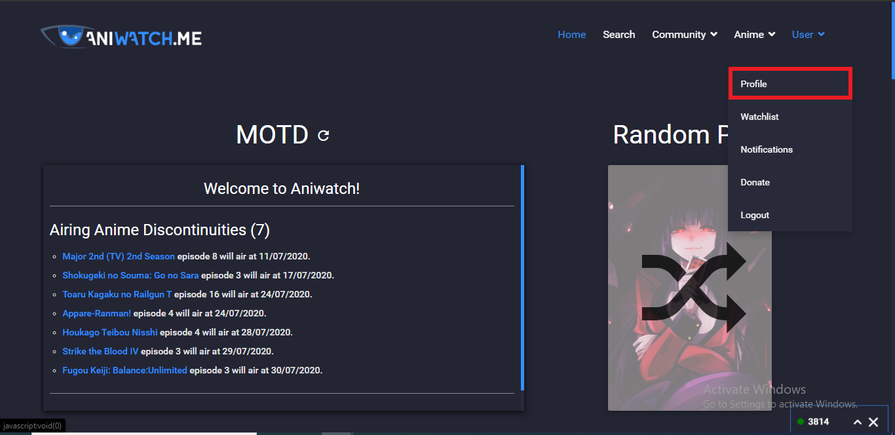
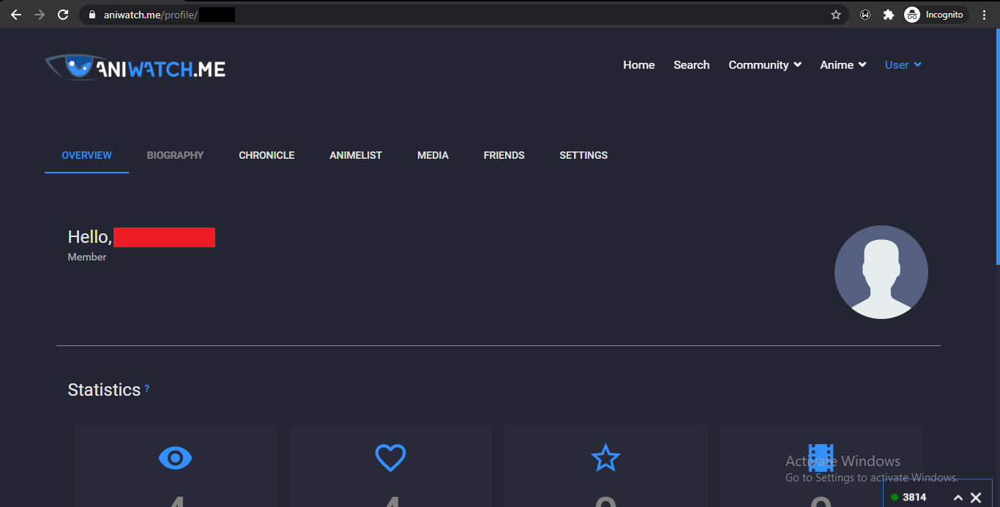
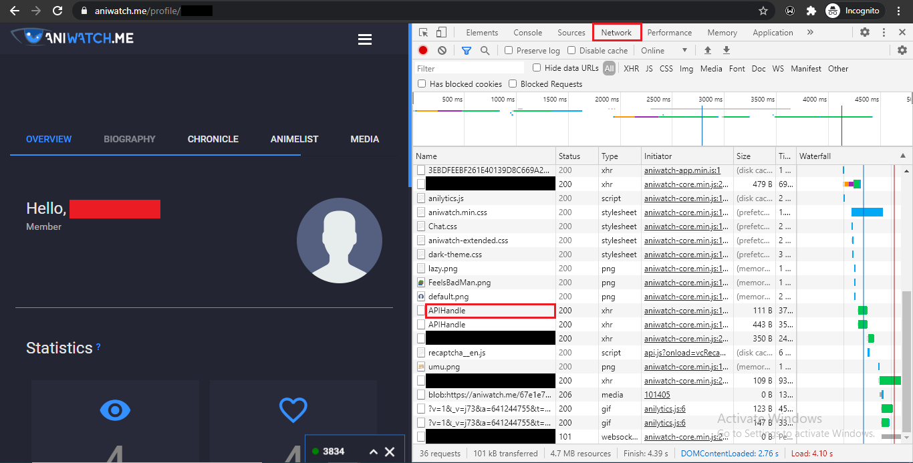
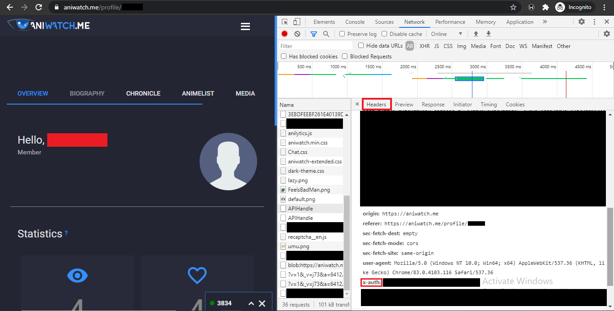

# Sakurajima
Sakurajima is a Python 3 API wrapper for AniWatch.me and contains most endpoints.
## Usage
1. Install the package `pip install sakurajima`
2. Use it.
<<<<<<< HEAD
=======

>>>>>>> 6bbb0dd419f4983d9db4bc0f4c7fc43ae523ade2

## How to get auth token and user ID.
Step 1:
Login in to your aniwatch.me account and go to your profile.

Step 2:
Notice the URL of the page. The page URL contains your user ID. 
The number following the "profile/" is your user ID.

Example: `aniwatch.me/profile/[YOUR-USERID]`

Step 3:
Now press F12 on your keyboard. This should open a tab similar to the one shown below. Navigate to the 'Network' tab (refresh the page if you don't see anything in the network tab) and look for 'APIHandle' in the list.

 

Step 4:
Click on the 'APIHandle' and under the 'Headers' tab expand the 'Request Headers' list and look for a header called 'x-auth'. This string of random letters is your auth token.

 
<<<<<<< HEAD
=======

>>>>>>> 6bbb0dd419f4983d9db4bc0f4c7fc43ae523ade2
